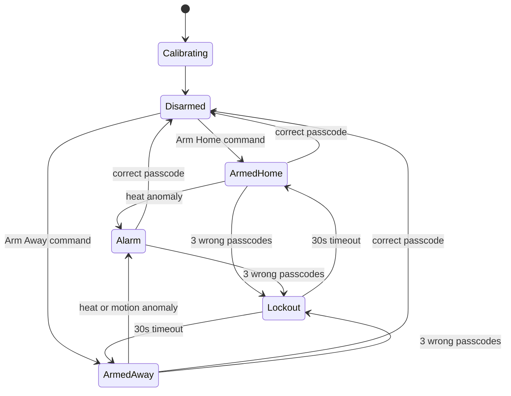

#  Smart Security System — Raspberry Pi Pico W

A cloud-connected home security system built on the Raspberry Pi Pico W, featuring a finite state machine architecture, adaptive (self-calibrating) anomaly detection, and full remote control via Firebase and a Node-RED dashboard.

Built as a self-directed project during my 2nd year of B.Tech (CSE), to go deeper into embedded systems and IoT than a typical "turn LED on/off" mini project.

---

##  Features

- **Finite State Machine architecture** — 6 clearly defined states (`Calibrating`, `Disarmed`, `Armed-Home`, `Armed-Away`, `Alarm`, `Lockout`) with controlled transitions, instead of ad-hoc if/else logic
- **Adaptive anomaly detection** — at boot, the system samples the room for ~8 seconds to learn a baseline mean & standard deviation for temperature and distance, then flags *deviations from that baseline* rather than relying on arbitrary fixed thresholds
- **Two arming modes** — "Away" mode monitors both motion and heat; "Home" mode only monitors heat, so you can move around inside without false alarms
- **Context-aware alarm response** — a heat/fire anomaly automatically unlocks the door for safe evacuation, while an intrusion anomaly keeps the door locked
- **Passcode-based disarm** with brute-force protection — 3 incorrect attempts triggers a 30-second lockout
- **Remote control via Node-RED dashboard** — arm the system, view live sensor data, and enter the disarm passcode, all from a browser
- **Asymmetric remote access** — the system can be armed remotely, but the *only* way to disarm is the correct passcode. This is a deliberate security decision: it means a compromised cloud account can inconvenience the system (falsely arm it) but can never be used to break in
- **State persistence** — the system remembers whether it was armed even after a power loss, by saving state to flash

---

##  How It Works

### State Machine



### Calibration
On boot, the system samples the LM35 temperature sensor and the HC-SR04 ultrasonic sensor for 8 seconds to learn what "normal" looks like in its specific environment — this baseline (mean ± standard deviation) is what future anomaly checks are compared against.

### Remote Control Flow
```
Node-RED Dashboard  <--->  Firebase Realtime Database  <--->  Pico W
   (buttons, text input)      (Command / State / Sensors)      (FSM logic)
```

- **Arm Home / Arm Away buttons** → write `Command/Mode` → Pico reads it, arms accordingly
- **Passcode text input** → writes `Command/Passcode` → Pico compares it against the stored code
- Every command self-clears after being read, so it only triggers once
- Live `State`, `AlarmCause`, `FailedAttempts`, `Temperature`, and `Distance` are pushed to Firebase every ~2 seconds and displayed on the dashboard

---

##  Hardware Used

| Component | Role |
|---|---|
| Raspberry Pi Pico W | Main controller (MicroPython) |
| 2x LED | System/armed status + alarm/warning indicators |
| Buzzer | Audible alarm (continuous for intrusion, rapid pulse for fire) |
| Relay | Simulated electronic door lock |
| 16x2 LCD | Local status display |
| HC-SR04 Ultrasonic Sensor | Motion/intrusion detection |
| LM35 Temperature Sensor | Heat/fire anomaly detection |

##  Tech Stack

- **MicroPython** — firmware logic, state machine, sensor processing
- **Firebase Realtime Database** — cloud state sync via REST API
- **Node-RED** — remote dashboard (arm/disarm controls, live sensor readouts)

---

##  Repository Contents

- `smart_security_system.py` — main firmware (FSM, sensors, Wi-Fi, Firebase sync)
- `node_red_dashboard_flow.json` — importable Node-RED flow for the dashboard
- `wifi_test.py` — standalone Wi-Fi connectivity diagnostic script

##  Setup

1. Flash MicroPython onto your Pico W.
2. Wire up components as per the pin mapping at the top of `smart_security_system.py`.
3. Fill in your Wi-Fi credentials and Firebase project URL/secret in the config section.
4. Create a Firebase Realtime Database with this structure:
   ```
   Command/
     Mode: "NONE"
     Passcode: ""
   State: ""
   AlarmCause: ""
   FailedAttempts: 0
   Sensors/
     Temperature: 0
     Distance: 0
   Timestamp/
     time: 0
   ```
5. Import the Node-RED flow, update the Firebase URL/secret in its HTTP request nodes, and deploy.

---


##  What I Learned

Building this pushed me past basic GPIO control into real systems-design problems: managing state cleanly, designing sensor logic that adapts to its environment instead of relying on guessed thresholds, and thinking through security trade-offs (like why remote disarm shouldn't exist) rather than just making everything controllable for convenience.
